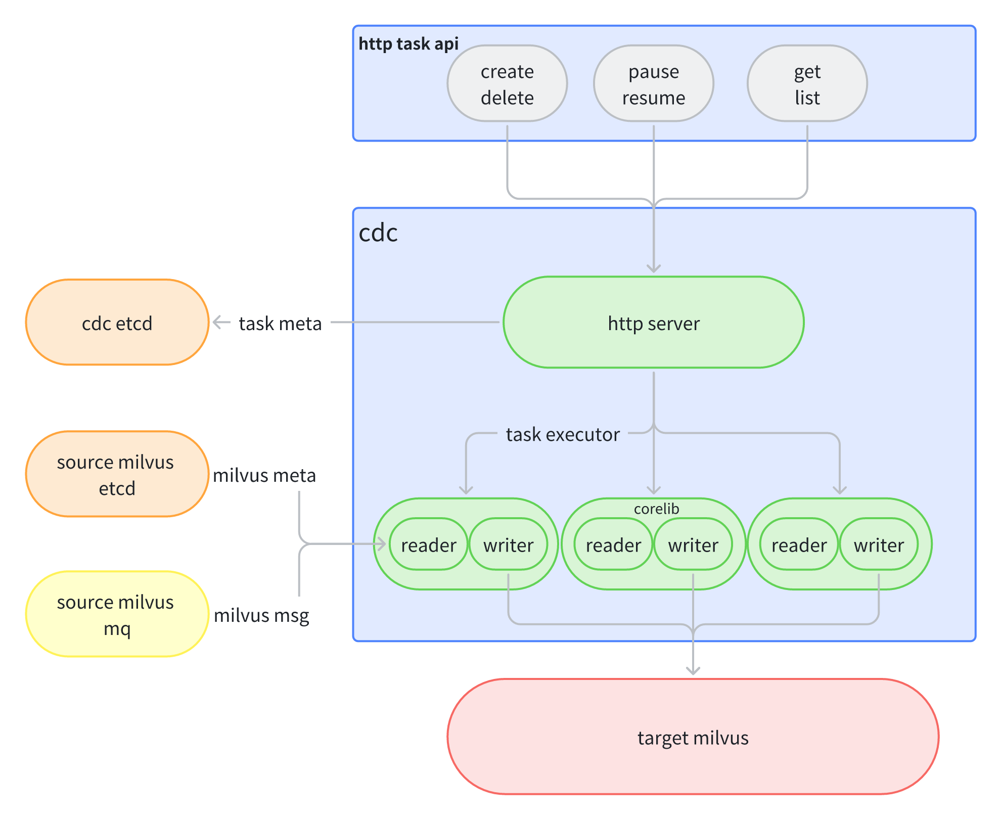
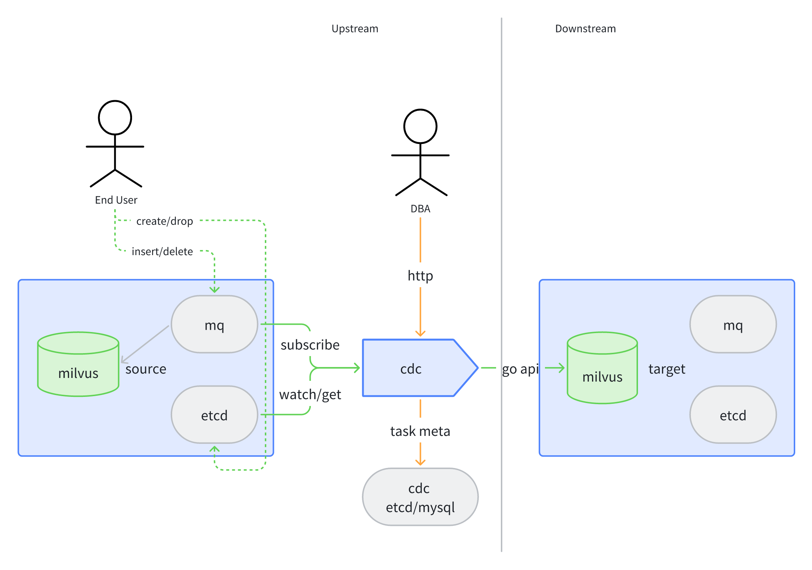

# Milvus-CDC

CDC is "Change Data Capture", and Milvus-CDC is a change data capture tool for Milvus. It can capture the changes of upstream Milvus collections and sink them to downstream Milvus. This will bring the following benefits:

1. Data reliability is improved and the probability of data loss is reduced;
2. Based on CDC, the active-standby disaster recovery feature of milvus can be implemented to ensure that even if the milvus-source cluster fails, it can be quickly switched to ensure the availability of upper-layer services;

## Quick Start

**Please use the source code to compile and use it now**, because milvus-cdc is undergoing rapid iteration, the image currently provided is not stable, and the implementation method has also changed a lot.

```bash
git clone https://github.com/zilliztech/milvus-cdc.git

make build
```

After successfully building, the `cdc` bin file will be generated in the `server` directory.

**DON'T execute it directly.** If you do it, I think you must get a error because you need to configure it before using it. How to configure and use cdc, refer to: [Milvus-CDC Usage](doc/cdc-usage.md)

## Basic Components

At present, cdc mainly consists of two parts: http server and corelib.

- The http server, is responsible for accepting user-side requests, controlling task execution, and maintaining meta-information;
- corelib,  is responsible for synchronizing the execution of tasks, including reader and writer:
   - reader reads relevant information from etcd and mq of source Milvus;
   - The writer converts the msg in mq into Milvus api parameters and sends the request to the target Milvus;



## CDC Data Processing Flow

1. User creates cdc task through http interface;
2. Obtain collection-related meta-information through etcd in Milvus-source, such as the channel information and checkpoint information corresponding to the collection, etc;
3. After obtaining the meta-information related to the collection, connect to mq(message queue) to subscribe to the data;
4. Read the data in mq, parse the data and forward it through go-sdk or perform the same operation as milvus-source;



